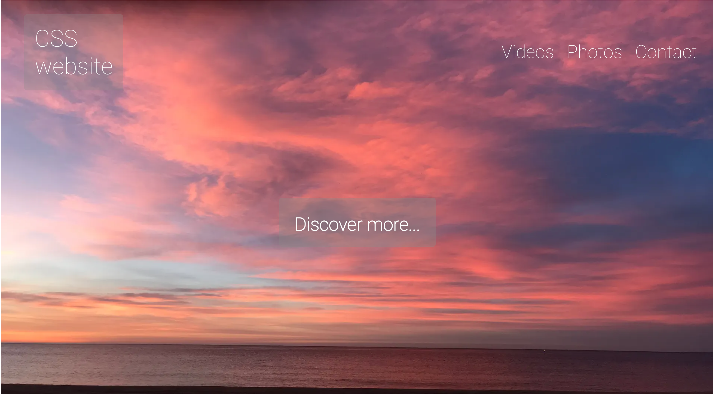
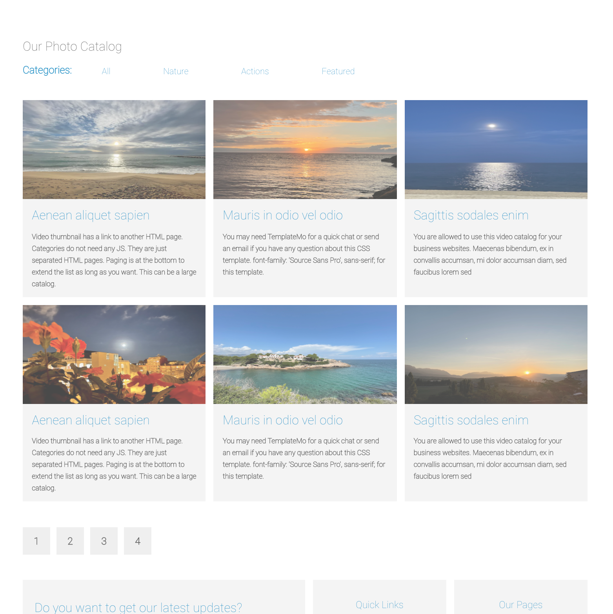

<div id="top"></div>
<br />
<div align="center">

  <h3 align="center">CSS WEBSITE</h3>

  <p align="center">
    A project created to show parts of my knowledge with CSS.
    <br />
    <!--  -->
    <br />
    <br />
    <a href="https://css-website-practice.netlify.app/">View website</a>
    ·
  </p>
</div>

<!-- ABOUT THE PROJECT -->

## About The Project


  
 


  Thank you for visiting! I created this project to display parts of my knowledge with CSS.
  It's a mock-up of a potential blog or photolibrary.


<!-- GETTING STARTED -->

## Getting Started

### Installation -->

_To use to project, follow the two simple steps below._

2. Clone the repo
   ```sh
   git clone https://github.com/toveadam/css-website.git
   ```
3. Install NPM packages
   ```sh
   npm install
   ```

<!-- CONTACT -->

## Contact

Tove Adamsson - toveadamsson@gmail.com

Project Link: [https://github.com/toveadam/css-website](https://github.com/toveadam/css-website)

<p align="right">(<a href="#top">back to top</a>)</p>

